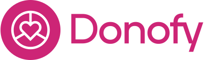

# Donofy

### This site is designed as a...
........

## [Click here to deploy this project live]()

**PLEASE NOTE: This documentation contains many images which can be viewed via a dropdown toggle.**

## Table of Contents
* [**Planning and Development**](#planning-and-development)
    * [***Target Users***](#target-users)
    * [***User Stories***](#user-stories)
    * [***Site Objectives***](#site-objectives)
    * [***Approach***](#approach)
    * [***Research***](#research)
    * [***Data Schema***](#data-schema)
    * [***Wireframes***](#wireframes)
    * [***Colour Scheme***](#colour-scheme)
    * [***Typography***](#typography)
* [**Features**](#features)
* [**Future Features**](#future-features)
* [**Testing**](#testing)
  * [Go to TESTING.md](TESTING.md)
* [**Deployment**](#deployment)
  * [Click here to deploy this project live](/https://boardgame-buddy-c89ff5d28931.herokuapp.com/)
* [**Languages**](#languages)
* [**Frameworks and Tools**](#frameworks-and-tools)
* [**Software**](#software)
* [**Imported Code**](#imported-code)
* [**Credits**](#credits)
* [**Thanks**](#thanks)

[**Back to top**](#donofy)

## Planning and Development
### Target Users
- Users of all age groups, but primary audience are working age.
- Users who want fast and easily accessible information on a range of charities.
- Users who want to give to multiple charities but consolidate their charity contributions into one monthly payment.
- Users who want full control over a charity amount they can afford. 
- Charity representatives who would like their charity included on the plafform. 

### User Stories
1. **As a new/guest user, I want to:**
  - A: quickly understand the purpose of the site.
  - B: find the navigation intuituve, with information easy and quick to find. 
  - C: understand the value of registering for an account.
2. **As a registered user, I want to:**
  - A: log in and manage my account details so they're current.
  - B: quickly find charities that interest me, and add them to my own "Favourites" list.
  - C: feel positive feedback from even the smallest donation I make. 
  - D: understand my impact over a longer period of time / see my payment history. 
  - E: have full control over how my donation amount is split between multiple causes.
  - F: be able to adjust my donations as my preferences change.
  - G: see a summary of my donation breakdown before I set/adjust my subscription.
  - H: receive a notification before my any sub is paid, with time to adjust it if I want to make changes.
  - I: receive a thank you email, every time a donation payment from me is processed. 
  - J: easily contact the site admins for any reason, including account deletion. 
  - K: receive a notification email if there are any issues with my subscription, so I can address them. 
4. **As a Charity representative, I want to**
  - A: easily contact the site admins to register a new charity with the platform.
  - B: easily contact the site admins if I need information on my charity page editing.
5. **As any user, I want to**
  - A: view and use the platform on any device.
  - B: have the site be accessible.
  - C: easily direct to a charity's main website for more information.

### Site Objectives
1. To provide a positive user experience.
2. To create an intuitive UI that provides good site flow.
3. To build a family-friendly product.
4. To deliver a site that is responsive on a large variety of screen sizes and mobile devices.
5. To create a fast, reliable site that can fetch a lot of information quickly and display it clearly.
6. To allow users to create their own profiles, with log in functionality that is secure.
7. To give users the functionality to update their own profile.
8. To allow users full CRUD functionality on their Favourited Charties list.
9. To provide a secure subscription payment system, that's easy to use and adjust.

### Approach
- Mobile first design.
- The site functionality will be provided to the user logically and intuitively.
- The site will be created following the principles of user experience design.
- The content of the site will be inoffensive and accessible to all.
- Clean, professional design, with consistent colour-scheme, style and layouts throughout.

### Research
The following sites were examined as part of my project research:
...
...
...

Common themes found:
  - Responsive design.
  - ...
  - ...

My adjustments to suit my project aims:
  - Reduce info on the main library page to what's essential.
  - Give full page space to a single game when the user wants more info.
  - ...

[**Back to top**](#donofy)
### Data Schema

### Wireframes

Balsamiq was used to create initial layouts and wireframes.
Some features and pages have been edited or removed entirely to meet project deadlines.

Please toggle the following dropdowns to view the wireframe images.

This planning and development work is uploaded to Figma. The design page on Figma is a useful tool to layout all my early project documents in one space, and share online with others for additional input. It allowed my mentor to quickly view and understand my project themes and objectives. 

Using Figma's wireframes capabilities, I was able to play with initial layouts and plan intuitive flow around my site. This has given me a good understanding of how an MVP might be presented to me by a frontend designer.

### Colour Scheme

### Typography
The highly legible and readable googlefont, League Spartan, has been selected. With Arial, Helvetica and a standard sans-serif as back up. There can be a lot of data displayed, especially on large screens, so the typography needs to be as clear and clean as possible. As a googlefont, League Spartan is less likely to have compatibility issues with different browsers.

[**Back to top**](#donofy)
## Features

This project includes many features, these include:

### Fully Responsive 

- This site adapts to all devices and screen sizes ranging between 320px to 2560px wide (Tested).
- Responsive break points tested on screen widths: 320px / 576px / 768px / 992px / 1200px / 1400px / 2560px. 

### Intuitive Navigation

### Clear typography
- League Spartan is a highly readable font, with Arial, Helvetica and standard sans-serif as backups. 

### Custom Logo

- Custom designed Logo in keeping with project brand aesthetics: both in colour and typography.
- SVG format for optimum resolution quality at all screen sizes.
- With thanks to Shaun Russell for the logo design.

### Images

### Search filters functionality
- Users can filter the charities library to view only the causes that interest them. 
- Searches are instantaneous

### High performance / fast loading times. 

### User profile creation and editing
- Users are allowed to create and edit their own profile account. 

### Large Font and Buttons
- With the exception of some form/button help text, all main site text remains a minimum of 1rem (16pt) font size for readability and accessibility. 
- All buttons maintain a minimum size of 48px x 48px. These are the WCAG 2.1 recommended guidelines for touchscreen buttons.
- Large buttons also improves accessibility for people with physical disabilities who have dexterity needs.

### Theme appropriate colour scheme
- A dark pink has been selected as the main brand colour. A compassionate shade, without being too light and feminine. It has the urgency of red, without the alarm or aggression. The mid range shade of pink gives good contrast for reading text on both dark and light backgrounds. 
- Eye comfort. There is no black on white (or visa versa). This is with all user's comfort in mind, but also for those with high visual needs.  

### High Standards of Accessibility 
[According to accessguide.io](https://www.accessguide.io/)

- .#.#.#. Rating for accessibility on Lighthouse scores.
- Definite status messages - 404 page included.
- Responsive design.
- High colour contrast.
- No colours convey information - colour blind users
- No flashing lights.
- No background audio or autoplay audio.
- Aria-labels on all interactive elements.
- Alt descriptions on all images.
- Semantic elements to assist screen reader users to navigate and access information.
- Consistent navigation.
- Minimum font size of 16px throughout the site and on all screen sizes.  

### Family Friendly
- This site is free from offensive language and imagery, and is suitable for users of all ages. As no content can be created by users, this standard is easily maintained. Users will have the ability to contact site admins via a contact form, should any content issues arise. 

### The Footer
The footer provides copyright information and name of the site creator. Plus clickable links to my github and linkedin pages. (Icons intentionally large for better accessibility - easier to press)

[**Back to top**](#donofy)
## Future Features

## Future Features Requested my user testers

[**Back to top**](#donofy)
## Testing
- Please see full documentation for testing and bug reports [here](./TESTING.md)

## Deployment
[Click here to deploy this project live](###)

### **Languages**
- HTML
- CSS
- Javascript
- Python

### **Frameworks and Tools**
- Git
- GitHub
- Bootstrap 4.6
- JQuery
- Django
- django-allauth
- Stripe
- Visual Studio Code
- Font Awesome
- GoogleFonts - League Spartan
- Figma
- Favicon.io
- Tinypng.com
- Lighthouse
- W3C Markup validation service
- W3C Jigsaw CSS validation service
- WAVE WebAIM web accessibility evaluation tool

### **Software**
- SQLite3
- Stripe
- Heroku - Deployment
- Visual Studio Code to create, load and push my code to Github.
- Git and Github as my version control system for the site.
- Figma to create design-boards, wireframes and prototypes.

[**Back to top**](#donofy)
## **Imported Code**
Template code blocks taken from [Bootstrap 4.6 Library](https://getbootstrap.com/docs/4.6/components/alerts/). Heavily modified to suit my project requirements.

Bootstrap 4.6 Navbar

Bootstrap 4.6 Nav-tabs

Bootstrap 4.6 Image-card

## **Tutorials** ##

## **Credits**
- Shaun Russell: site logo.
- Favicon.io for icon converter & instructions [View here](https://favicon.io/)
- Tinypng.com for image compression [View here](https://tinypng.com/)
- Accessguide.io an excellent accessibility guide [View here](https://www.accessguide.io/)

## Site Testers
- Shaun Russell - Senior UI/UX designer

## **Thanks**
- Richard Wells: Senior Developer, site tester, and my Code Institute Mentor. Thank you for going above and beyond with your support and patience! I massively appreciate the time and expertise you've given me.

- Tom Harris: Site tester, and my biggest cheerleader.

- Shaun Russell: Senior UX/UI/Product Designer. My site tester, my partner, and my provider while I study. Building my new development career change would have been infinitely harder without you. Thank you.

[**Back to top**](#donofy)