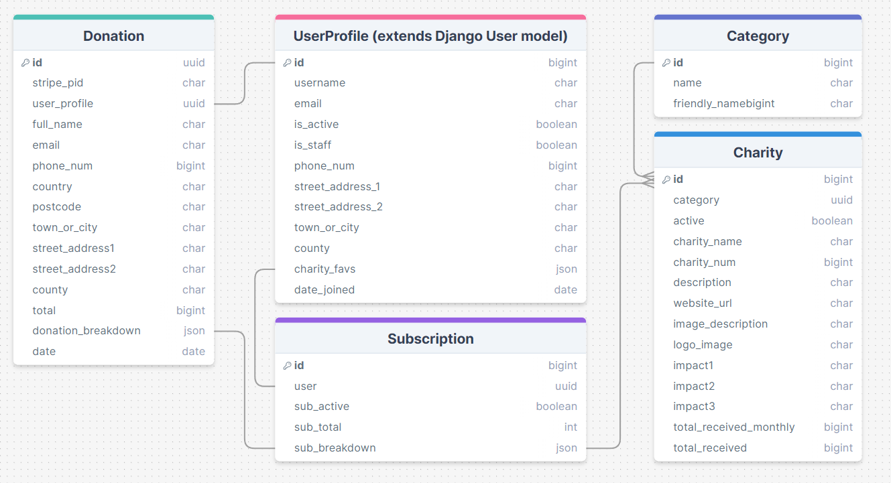
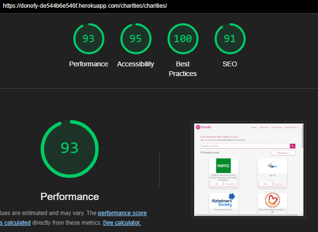
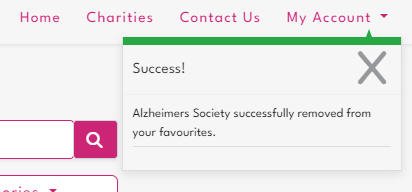
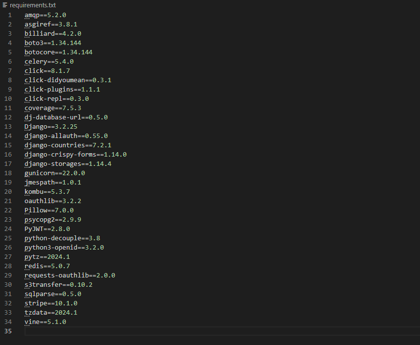

# Welcome to Donofy

### This site is designed as a Charities donation site. 

## [Click here to deploy this project live](https://donofy-de544b6e546f.herokuapp.com/)

**PLEASE NOTE: This documentation contains many images which can be viewed via a dropdown toggle.**

## Table of Contents
* [**Planning and Development**](#planning-and-development)
    * [***Target Users***](#target-users)
    * [***User Stories***](#user-stories)
    * [***Site Objectives***](#site-objectives)
    * [***Approach***](#approach)
    * [***Research***](#research)
    * [***Data Schema***](#data-schema)
    * [***Wireframes***](#wireframes)
    * [***Colour Scheme***](#colour-scheme)
    * [***Typography***](#typography)
* [**Features**](#features)
* [**Future Features**](#future-features)
* [**Testing**](#testing)
  * [Go to TESTING.md](TESTING.md)
* [**Deployment**](#deployment)
  * [Click here to deploy this project live](https://donofy-de544b6e546f.herokuapp.com/)
* [**Admin Access**](#admin-access)
* [**Test Payments**](#test-payments)
* [**Setup and Installation**](#setup-and-installation)
* [**Languages**](#languages)
* [**Frameworks and Tools**](#frameworks-and-tools)
* [**Software**](#software)
* [**Imported Code**](#imported-code)
* [**Credits**](#credits)
* [**Thanks**](#thanks)

[**Back to top**](#donofy)

## Planning and Development
### Target Users
- Users of all age groups, but primary audience are working age.
- Users who want fast and easily accessible information on a range of charities.
- Users who want to give to multiple charities but consolidate their charity contributions into one payment.
- Users who want full control over a charity amount they can afford. 

### User Stories
1. **As a new/guest user, I want to:**
  - A: quickly understand the purpose of the site.
  - B: find the navigation intuituve, with information easy and quick to find. 
  - C: understand the value of registering for an account.
2. **As a registered user, I want to:**
  - A: log in and manage my account details so they're current.
  - B: quickly find charities that interest me, and add them to my own "Favourites" list.
  - C: feel positive feedback from even the smallest donation I make. 
  - D: understand my impact over a longer period of time / see my payment history. 
  - E: have full control over how my donation amount is split between multiple causes.
  - F: be able to adjust my donations as my preferences change.
  - G: see a summary of my donation breakdown before I set/adjust my subscription.
  - H: receive a thank you email, every time a donation payment from me is processed. 
  - I: easily contact the site admins for any reason, including account deletion. 

4. **As any user, I want to**
  - A: view and use the platform on any device.
  - B: have the site be accessible.
  - C: easily direct to a charity's main website for more information.

### Site Objectives
1. To provide a positive user experience.
2. To create an intuitive UI that provides good site flow.
3. To build a family-friendly product.
4. To deliver a site that is responsive on a large variety of screen sizes and mobile devices.
5. To create a fast, reliable site that can fetch a lot of information quickly and display it clearly.
6. To allow users to create their own profiles, with log in functionality that is secure.
7. To give users the functionality to update their own profile.
8. To allow users full CRUD functionality on their Favourited Charties list.
9. To provide a secure payment system, that's user friendly.

### Approach
- Mobile first design.
- The site functionality will be provided to the user logically and intuitively.
- The site will be created following the principles of user experience design.
- The content of the site will be inoffensive and accessible to all.
- Clean, professional design, with consistent colour-scheme, style and layouts throughout.

### Research
The following sites were examined as part of my project research:
- [charitychoice.co.uk](https://www.charitychoice.co.uk/charities)
- [YouGov.co.uk](https://yougov.co.uk/ratings/politics/popularity/charities-organisations/all)
- [gov.uk register of charities](https://register-of-charities.charitycommission.gov.uk/charity-search)

Common themes found:
  - Responsive design.
  - Accessible Design
  - Statistics
  - Offical registered Charity numbers

My adjustments to suit my project aims:
  - Provide enough data without overwhelming my user.
    - Visual charity cards directory, and charity logos are obvious.
    - Summary of the charity and the impact of donations.
    - Button to direct the user to the offical charity site for more info. (Opens in a new tab)
  - Bright and friendly colour scheme, not affliated with any particular charity. Also not so sterile that the data is unappealing to browse. Whilst still keeping to good accessibility standards.
  - User has the ability to bookmark charities that interest them in a Favourites list. Invites future visits as user can easily find their selected favourites and build on their list according to their preferences.

[**Back to top**](#donofy)
### Data Schema

**Data Flow Notes.**
- Donofy site has a directory of Charities, which are assigned a Category for search/filtering purposes. 
- Users can create a profile with create, read, and update functionality. 
- Users can Add and Delete charities to their Favourites List.
- The subscription model is the user's latest preferences of values to donate to selected charities in their favourites list. 
- Donation objects are created on successful checkout of a donation payment by the user. It is an instance of the user's billing details, plus subsciption total and breakdown at the time/date the donation was made.
- 'Active' booleans have been given to data tables where would deletion would erase data that needs to be preserved. (e.g User's and their history of donations. Charities and their running totals data.)

### Wireframes

- Some differences can be seen from planning to build.

This planning and development work is uploaded to Figma. The design page on Figma is a useful tool to layout all my early project documents in one space, and share online with others for additional input. It allowed my mentor to quickly view and understand my project themes and objectives. 

Using Figma's wireframes capabilities, I was able to play with initial layouts and plan intuitive flow around my site. This has given me a good understanding of how an MVP might be presented to me by a frontend designer.

### Colour Scheme

A dark pink has been selected as the main brand colour. A compassionate shade, without being too light and feminine. It has the urgency of red, without the alarm or aggression.  The black and whites have been softened from their extreme #000 and #fff. This is to reduce screen glare. White or black have been used where text constrast has needed to be increased on other brand colours for readability. 

### Typography
The highly legible and readable googlefont, League Spartan, has been selected. With Arial, Helvetica and a standard sans-serif as back up. There can be a lot of data displayed, especially on large screens, so the typography needs to be as clear and clean as possible. As a googlefont, League Spartan is less likely to have compatibility issues with different browsers.

[**Back to top**](#donofy)
## Features

This project includes many features, these include:

### Fully Responsive 
- This site adapts to all devices and screen sizes ranging between 320px to 2560px wide (Tested).
- Responsive break points tested on screen widths: 320px / 576px / 768px / 992px / 1200px / 1400px / 2560px.

### Intuitive Navigation
- The navigation bar remains at the top of the screen with navigation links to the right. In keeping with typical user expectations.
- All pages can be accessed within 1-3 user clicks.
- Often there are multiple ways for the user to navigate to the same pages/sections.
- If no data is found for a particular section (e.g No favourites saved for the My Donofy panel), user's will see a message explaining why the content is blank and be prompted with instruction on how to proceed.
- When Favourites are selected by clicking the Favourite button. The button changes colour and toggles to Deactivate. A highly visible, and easily-understood indication of which charities are in a user's favourites list.
- All interactive elements (buttons, anchors, nav-links) have colour changes, or underline decorators, or hover animations, or shadows, or any combination of these signals, to indicate interactivity. 

### Clear typography
- [League Spartan](https://fonts.google.com/specimen/League+Spartan) is a highly readable font, with Arial, Helvetica and standard sans-serif as backups. 

### Custom Logo

- Custom designed Logo in keeping with project brand aesthetics: both in colour and typography.
- SVG format for optimum resolution quality at all screen sizes.
- With thanks to Shaun Russell for the logo design.

### Images
- A striking hero image greets the user on the landing page. Overlayed with a colour filter in the same site brand pink. 
- Charity logos and emotive images are used for charity brand recognition, and charity mission context.

### Search filters functionality
- Users can filter the charities library to view only the causes that interest them. 
- Searches are instantaneous

### High performance / good loading times.
- Some short delays have been recorded on some load times. These are mainly due to Heroku, Stripe, and large layout reshuffles to maintain a responsive site. 

### User profile creation and editing
- Users are allowed to create, view and edit their own profile account. 

### Form autofill for user's with saved profile information.

### Built in form validation

### User feedback via messaging and button toggles

### Secure online payment functionality with Stripe
- https:// site address
- With immediate positive user feedback on successful checkout.

### Payment History logs

### Live email functionality
- The site sends automated emails on successful donations, confirming the donation paid, it's details and thanking the user for additional positive experience. 
- Live email also allows for additional functionality such as Password Reset.

### Contact Us Page

### Large Font and Buttons
- With the exception of some form/button help text, all main site text remains a minimum of 1rem (16pt) font size for readability and accessibility. 
- All buttons maintain a minimum size of 48px x 48px. These are the WCAG 2.1 recommended guidelines for touchscreen buttons.
- Large buttons also improves accessibility for people with physical disabilities who have dexterity needs.

### Theme appropriate colour scheme
- A dark pink has been selected as the main brand colour. A compassionate shade, without being too light and feminine. It has the urgency of red, without the alarm or aggression. The mid range shade of pink gives good contrast for reading text on both dark and light backgrounds. 
- Eye comfort. There is no black on white (or visa versa). This is with all user's comfort in mind, but also for those with high visual needs.  

### High Standards of Accessibility 
[According to accessguide.io](https://www.accessguide.io/)

- Consistently high ratings for accessibility on Lighthouse scores.
- Definite status messages - 404 page included.
- Responsive design.
- High colour contrast.
- No colours convey information - colour blind users
- No flashing lights.
- No background audio or autoplay audio.
- Aria-labels on all interactive elements.
- Alt descriptions on all images.
- Semantic elements to assist screen reader users to navigate and access information.
- Consistent navigation.
- Minimum font size of 16px throughout the site and on all screen sizes.
- All buttons maintain a minimum size of 48px x 48px. These are the WCAG 2.1 recommended guidelines for touchscreen buttons.
- Large buttons also improves accessibility for people with physical disabilities who have dexterity needs.

### Family Friendly
- This site is free from offensive language and imagery, and is suitable for users of all ages. As no content can be created by users, this standard is easily maintained. Users will have the ability to contact site admins via a contact form, should any content issues arise. 

### The Footer
The footer provides copyright information and name of the site creator. Plus clickable links to my github and linkedin pages. (Icons intentionally large for better accessibility - easier to press)

[**Back to top**](#donofy)
## Future Features

* **Automated subscription payment methods.**
  - Users can set regular monthly payments to be taken on a set day every month.
  - Users would be able to edit their subscription details (selected charities, and amounts etc) in between payments.
  - Users could cancel or pause their subscriptions between payments.
  - Users would receive a notification of an upcoming payment (approx 5 days notice) with an opportunity to edit or cancel before their billing date.
  - Users would continue to receive an email everytime a donation is made (automated or not) for as long as their subscription is active.

* **Single payments for guest users** who do not want to create an account.

* **Donation preferences auto updating**. Donation preferences on the My Donofy section would have change event listeners, and update the breakdown and total dynamically, without the user being required to "Save" their changes. 

* **Authorised admin access for Charity representatives**, to give access to update their own charity page information.

* **Badges or 'achievement' awards/icons**
  - users can earn and 'collect' on their profile. Adding to positive UX, giving a greater sense of making an impact, and gamifying the UX to encourage more donations.
  - 'Achievements' examples such as: 1st donation made, 3 doantions, 10 donations etc, subcription created, 6 months of consecutive donations etc.
  - Achievements would be focused on actions rather than amounts donated to keep in line with the site ethos: every donation counts, even the smallest. 

* **Automated running totals**
  - Home page stats would dynamically update according to site wide statics on donation figures. 
  - As well as a payment history, users could view their own dynamic totals of how much they donated via Donofy, and a breakdown of how much given to each charity. 
  - The totals per charity, could link to a charity's impact statments, and a user could toggle between, how much they've donated, or how their donations translate into real-life impact. (e.g User 1 has donated £32 to Dogs Trust /toggle/ User 1 has kept a rescue dog fed for 31 days ).

[**Back to top**](#donofy)
## Testing
- Please see full documentation for testing and bug reports [here](./TESTING.md)

## Deployment
[Click here to deploy this project live](https://donofy-de544b6e546f.herokuapp.com/)

## Admin Access

A general superuser has been created for this project to view backend features and access some project functions and permissions that need to be secure. A handy Admin nav link will appear in the "My Account" dropdown on the main navbar. This takes an authorised user directly to the site admin backend panels to view/edit/delete data. (To preserve data, users and charities can be toggled to Inactive, instead of being deleted.).
Superusers can directly toggle a charity to inactive on the frontend, by navigating to that charity's details page. A deactivate button appears at the bottom of the details page. 

To log in as a superuser and access the admin features. Please log in with the following details:

  - username = superuser1
  - password = Auth0risedAdmin0nly123

## Test Payments

Donofy has fully functioning, secure, online payment functionality with Stripe. To test this please follow these steps. 

1. Create a Donofy account and log in. (Please use a real email if you want to test email confirmations).
2. Navigate to the charities page and add at least 1 charity to your favourites. 
3. Navigate to My Accounts/My Donofy to view your created favourites list.
4. Enter donation amounts in whole integers (£) for at least one charity.
5. OPTIONAL: Navigate to My Details, enter personal details and save.
6. Navigate to My Accounts/Donate. (If you followed step 5, the form will prepopulate for you). Fill out the donation form. 
7. To make a test payment, please use the following card details:
    - **Card No:** 4242 4242 4242 4242

    - **Any future expiry date:**  (e.g. 01/25 )
    - **Any CVC code:**  (e.g. 123 )
    - **Any 5 digit zip:**  (e.g. 12345 )

8. Please note, stripe card input element is currently set to USA (hence the zip code required). This would be changed if the site is ever launched in the UK or otherwise. For now, the USA version remains to meet project deadlines, and demonstrate payment functionality. 

## Setup and Installation
### Dependencies
To run this project, you need to install the following dependencies. You can do this by running pip install -r requirements.txt in your command line. Ensure you are in the project's root directory where the requirements.txt file is located. (Gmail has been used for live emails. You may need to force Heroku to use an earlier version of Python. To do this: create a runtime.txt in the project root. In this file save this: python-3.10.12)

### Deployment
**1. Setup Heroku**
  - Sign up or log into [Heroku](https://www.heroku.com/)
  - On the main Heroku Dashboard, click 'New' > 'Create New App'.
  - Name your project (e.g. donofy ). The app name must be unique.
  - Choose your region and then click 'Create app'.

**2. Setup an PostgreSQL database**
  - Choose a PostgreSQL database provider (e.g ElephantSQL, NeonTech)
  - In your Heroku app config vars give it your database URL.

**3. Create a Procfile in the root of your development project**
  - Add: web: gunicorn PROJECT_NAME.wsgi

**4. Configure Heroku to your Django app**
  - Create an env.py in the root of your development project.
  - **In env.py, include the following variables :**
    - SECRET_KEY = <your_secret_key>
    - STRIPE_PUBLIC_KEY = <your_stripe_public_key>
    - STRIPE_PUBLIC_KEY = <your_stripe_public_key>
    - STRIPE_WH_SECRET = <your_webhook_signing_secret_for_your_endpoint>
    - DATABASE_URL = <your_database_url>
    - AWS_ACCESS_KEY_ID = <your_amazon_web_services_key_id>
    - AWS_SECRET_ACCESS_KEY = <your_amazon_web_services_access_key>
    - DEVELOPMENT=1
  - **In your project settings.py :**
    - ALLOWED_HOSTS = <your_deployed_heroku_url>
      - You can initially deploy to heroku without your static files uploaded to get your project URL. (See Heroku app config vars below.)
    - AWS_STORAGE_BUCKET_NAME = <your_amazon_web_services_S3_bucket_name>
    - AWS_S3_REGION_NAME = <your_AWS_region>
    - EMAIL_HOST = <your_live_email_provider>
  - **In your Heroku app config vars:**
    - DATABASE_URL = <your_database_url>
    - EMAIL_HOST_PASS = <your_live_email_passkey>
    - SECRET_KEY = <your_secret_key>
    - DISABLE_COLLECTSTATIC = 1
      - Deploy your site without static and media files first.
      - This is the purpose of: DISABLE_COLLECTSTATIC = 1
      - In Deployment method section of heroku: connect your Heroku app to your GitHub repo, then deploy.
      - Your initial deployed project will have no styles or images. But you will have your project URL.
    - **Setup your STRIPE, AWS S3 bucket and then include config vars:**
    - AWS_ACCESS_KEY_ID = <your_amazon_web_services_key_id>
    - AWS_SECRET_ACCESS_KEY = <your_amazon_web_services_access_key>
    - DATABASE_URL = <your_database_url>
    - EMAIL_HOST_PASS = <your_live_email_passkey>
    - SECRET_KEY = <your_secret_key>
    - STRIPE_PUBLIC_KEY = <your_stripe_public_key>
    - STRIPE_PUBLIC_KEY = <your_stripe_public_key>
    - STRIPE_WH_SECRET = <your_webhook_signing_secret_for_HEROKU_endpoint> **( Different to above )**
    - USE_AWS = True
    - ( REMEMBER TO REMOVE DISABLE_COLLECTSTATIC = 1 )

### **Languages**
- HTML
- CSS
- Javascript
- Python

### **Frameworks and Tools**
- Git
- GitHub
- Bootstrap 4.6
- JQuery
- Django
- django-allauth
- Stripe
- Amazon Web Services (S3)
- Visual Studio Code
- Font Awesome
- GoogleFonts - League Spartan
- Figma
- Favicon.io
- Tinypng.com
- Lighthouse
- W3C Markup validation service
- W3C Jigsaw CSS validation service
- WAVE WebAIM web accessibility evaluation tool

### **Software**
- SQLite3
- Stripe
- Heroku - Deployment
- Visual Studio Code to create, load and push my code to Github.
- Git and Github as my version control system for the site.
- Figma to create design-boards, wireframes and prototypes.

[**Back to top**](#donofy)
## **Imported Code**
Template code blocks taken from [Bootstrap 4.6 Library](https://getbootstrap.com/docs/4.6/components/alerts/). Heavily modified to suit my project requirements.

Bootstrap 4.6 Navbar

Bootstrap 4.6 Nav-tabs

Bootstrap 4.6 Image-card

[Bootstrap 4.6 Toasts](https://getbootstrap.com/docs/4.6/components/toasts/)

## **Tutorials** ##

Very Academy - Tutorial Video [Django Custom User Model, Extend User Fields](https://www.google.com/search?q=django+4+extending+user+model+tutorial&sca_esv=bb6fb22019ea88f6&sca_upv=1&rlz=1C1GCEU_enGB1105GB1105&ei=VeuDZrvwHYSghbIPzIqKuAg&oq=django+4+extending+user+model+tuto&gs_lp=Egxnd3Mtd2l6LXNlcnAiImRqYW5nbyA0IGV4dGVuZGluZyB1c2VyIG1vZGVsIHR1dG8qAggAMgcQIRigARgKMgcQIRigARgKMgcQIRigARgKSLQUUJ4EWN8IcAF4AZABAJgBfKAB2gOqAQM0LjG4AQHIAQD4AQGYAgagAuUDwgIKEAAYsAMY1gQYR8ICBhAAGBYYHsICCxAAGIAEGIYDGIoFwgIIEAAYgAQYogTCAgUQIRigAcICBBAhGBWYAwCIBgGQBgiSBwM1LjGgB6wW&sclient=gws-wiz-serp#fpstate=ive&vld=cid:662df13b,vid:NLHmadrP8Y4,st:0)

Loading Overlay animation / css / js - taken from Code Institute's Boutique Ado walkthrough project. Colour modified to align with my project's colour scheme.
[View Boutique Ado Project here](https://github.com/Code-Institute-Solutions/boutique_ado_v1/tree/4f4a39d898c2c347e0d0a0201e4c0d2d6ef1c500)

Checkout Views and webhook_handler taken from Code Institute's [Boutique Ado walkthrough](https://github.com/Code-Institute-Solutions/boutique_ado_v1/tree/933797d5e14d6c3f072df31adf0ca6f938d02218) and heavily modified to suit my projects requirements. 

## **Credits**
- Shaun Russell: site logo.
- Favicon.io for icon converter & instructions [View here](https://favicon.io/)
- Tinypng.com for image compression [View here](https://tinypng.com/)
- Accessguide.io an excellent accessibility guide [View here](https://www.accessguide.io/)

## Site Testers
- Richard Wells - Senior Developer, site tester, and my Code Institute Mentor.
- Shaun Russell - Senior UI/UX designer
- Tom Harris - Site Tester

## **Thanks**
- Richard Wells: Senior Developer, site tester, and my Code Institute Mentor. Thank you for going above and beyond with your support and patience! I massively appreciate the time and expertise you've given me.

- Tom Harris: Site tester, and my biggest cheerleader.

- To all my friends and family, who have supported me, asked after me, listened to me, commisserated with me, and celebrated with me. To all those who have felt my absence over the last 12 months as I take on this new venture. Thank you for your patience and support.  

- Shaun Russell: Senior UX/UI/Product Designer. My site tester, my partner, and my provider while I study. Building my new development career change would have been infinitely harder without you. Thank you.

[**Back to top**](#donofy)