# Testing Donofy
This project was tested continuously during development. Post build, the site has been manually tested by myself and third party testers. It has also passed on html, CSS, JS, and accessibility validators. The python has pass linting checks and is compliant with PEP8 industry standards.

[return to README.md](./README.md)

**PLEASE NOTE: This documentation contains many images which can be viewed via a dropdown toggle.**
## Table of Contents
* [**During Development Testing**](#during-development-testing)
    * [*Testing*](#testing)
    * [*Bugs and Fixes*](#bugs-and-fixes)
* [**Post Development Testing**](#post-development-testing)
  * [**Post Development Testing Expanded**](#post-development-testing-expanded)
    * [Home Page Manual Testing](#home-page-manual-testing)
  * [**User Story Testing**](#user-story-testing)
  * [**Validators**](#validators)
      * [*HTML*](#html---httpsvalidatorw3orgnu)
      * [*CSS*](#css---httpsjigsaww3orgcss-validator)
      * [*JavaScript*](#javascript---httpsjshint.com)
  * [**Lighthouse Scores**](#lighthouse-scores)
  * [**Accessibility**](#accessibility)
* [**Third Party Testing**](#third-party-testing)
*  [**Third Party Feedback**](#third-party-feedback)
* [**With Thanks**](#thank-you-to-my-product-testers)

## **During Development Testing**
This project has been developed partially with a TTD approach. 
During the development process, I also manually tested continuously in the following ways:-

1. Manually tested each element for appearance and responsiveness via a simulated live server by running app.py in PORT 5000.

2. Checked functionality as I built. Dealing with bugs and error messages during development. (See bugs and fixes)
    
3. Sought feedback from my mentor and student peers at key intervals during development. 

## Testing:

### Browser Compatibility
During testing, I used three different browsers to ensure cross-compatibility. The desktop browsers used by myself were:

  1. Chrome
  2. Firefox  
  3. Edge

I have manually tested on Chrome.
Shaun Russell - Site tester - Tested on Firefox, and Edge.
Tom Harris - Site tester - Tested the project on Safari.

### Screen Sizes

The site has been tested at screen sizes 320px to 2560px in width.

INSERT IMAGE MOBILE
INSERT IMAGE DESKTOP

### Function Testing
The functions are built using a TDD approach, and also thoroughly manually tested via their output displayed in the terminal with print statements, the browser display, or both. (All print statements have been removed in the final version of the project).

[**Back to top**](#testing-donofy)
## ***Bugs and Fixes:***

Below is a list of bugs I discovered and fixed using TDD and manual testing :-

1. **Testing charities view - IntegrityError1** - 
    * ***Issue Found:*** 
        * IntegrityError thrown when testing charities.views.all_charities view
        

Integrity Error

        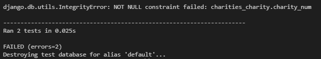
        

        

Test code

        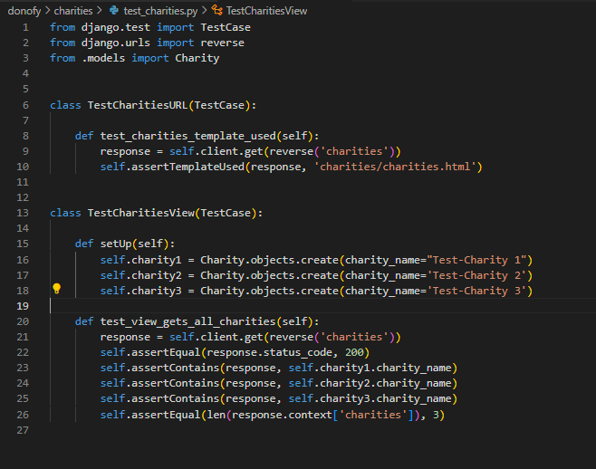
        

    * ***Solution Used:*** 
        * Added all remaining fields that will not accept null according to the Charity Model, to the test setup.
        

Integrity Error code fix

        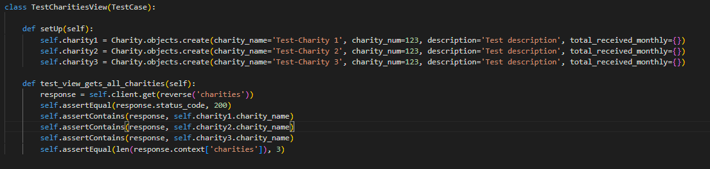
        

        

Test pass

        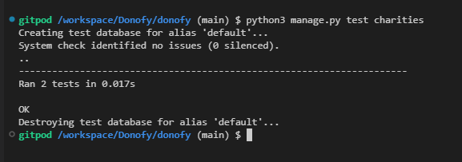
        

2. **Testing charities category sort**
    * ***Issue Found:***
        

Initial test failing

        
        

        

Value Error

        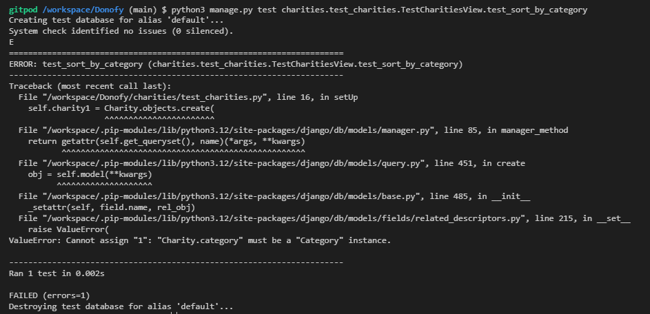
        

        

Assertion Error

        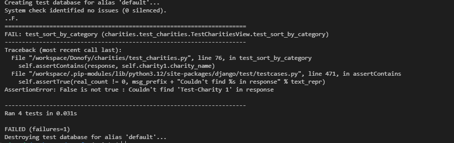
        

    * ***Solution Used:*** 
        * Value Error: required importing Charity model, and fixing some syntax.
        * Assertion Error: filters category by ID instead of name
        

Test Pass

        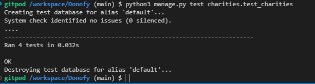
        

3. **Testing charities ASC / DESC order sort**
    * ***Issue Found:***
        

Initial test failing

        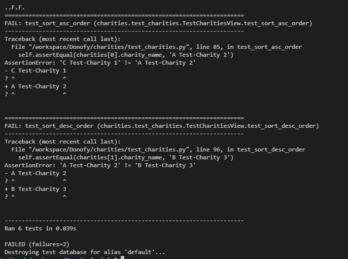
        

        

Name Error: Lower is not defined

        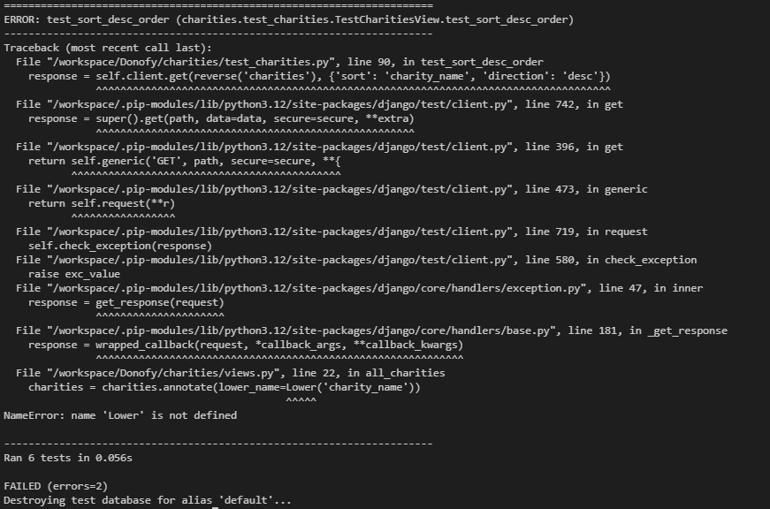
        

        

Assertion Error

        
        

        

Assertion Error ASC only

        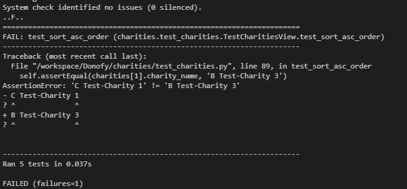
        

    * ***Solution Used:*** 
        * Name Error: added from django.db.models.functions import Lower
        * Assertion Error: had to abandon ascend/descend feature. Category sorts will automatically sort by ascending instead.
        * Assertion Error ASC only: removed the charity with active=False as that was creating the mis-ording and causing the test to fail
        

Test Pass

        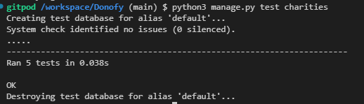
        

4. **UserProfileAdmin errors**
    * ***Issue Found:***
        * The following errors were thrown for UserProfileAdmin during a makemigration --dry-run
        * 1 x admin.E033 error
        * 4 x admin.E108 errors
        

UserProfileAdmin Migration Errors

        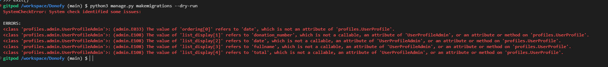
        

    * ***Solution Used:***
        * E108: changed ordering by non-existent 'date', to last_name instead
        * E108: removed the referred to fields as they will now be stored in new donations data.
        

UserProfileAdmin Migration Fixed

        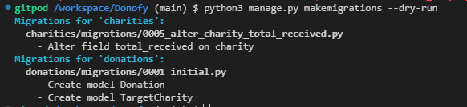
        

5. **Testing profiles**
    * ***Issue Found:***
        

First Test fail

        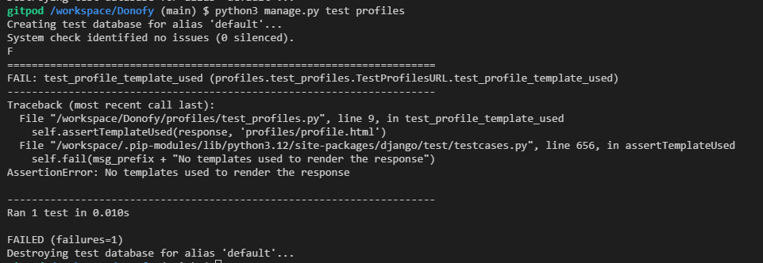
        

    * ***Solution Used:***
      * Imported User from models & added a 'testuser' to provide log in details for the test.
        

First Test pass

        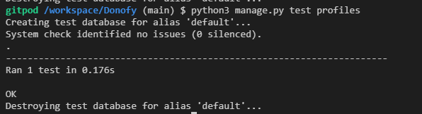
        

[**Back to top**](#testing-donofy)  
## **Post Development Testing**

Post development, I manually tested in the following ways:-

1. Manually tested each element for appearance and responsiveness via a simulated live server.

2. The code passed through HTML, CSS, JavaScript(ES6), pep8 validators to check for errors.
* [**Validators Results**](#validators)
3. The code passed through an Accessibility evaluation. 
*  [**Accessibility Results**](#accessibility)
4. Published the page via GitHub pages and shared with fellow students and friends to test and receive feedback.

5. Sent my deployed project to multiple user testers with different devices, browsers, and skill sets.
    - Jump to: [**Third Party Testing**](#third-party-testing) here

## **Post Development Testing Expanded**

My manual testing logs are as follows:
***
### Home Page Manual Testing
***
**TEST NAME**
* Expected:
  * 
* Testing:
  * 
* Result:
  * 
* Action: 
  * 
***

[**Back to top**](#testing-donofy)

### User Stories Testing

[**Back to top**](#testing-donofy)
## **Validators**

### HTML validator checks w3.org

### Home [View current results here]()

HTML validator for ### Initial Results

* ***Errors Found:***
    * 
* ***Action Taken:***
    * 

### CSS - [View current results here]()

* ***Errors Found:***
    * 
* ***Action Taken:***
    * 

### JavaScript Validator

JS validator Results Image

 

JSHint validator was configured to recognise New JavaScript Features (ES6), and jQuery.
* ***Errors Found:***
    * 
* ***Action Taken:***
    * 

### Python CI Linter (PEP8 check)

Python linter results

* ***Errors Found:***
    * 
* ***Action Taken:***
    * 

## Lighthouse Scores
### Test conditions
* All lighthouse tests were run from heroku and in incognito mode to avoid interference. 
* Both mobile and desktop performance are tested.
* The drop in performance on mobile is likely due to Heroku. 
* All my user testers reported fast load and response times on both desktop and mobile devices, so no adjusts will be made at this time. 

Desktop Results

 

Mobile Results

 
 

## **Accessibility** 
In addition to the accessibility score on lighthouse, WAVE - Web accessibility evaluation tool has been used to check the site for accessibility issues.. 
[View my results here]()  

Wave Accessibility Evaluation Results Image

 

Wave Alerts Image

 

* ***Errors Found:***
    * 
* ***Alerts Found:***
    * 
* ***Action Taken:***
    * 

[**Back to top**](#testing-donofy) 
### **Third Party Testing**
I sent my deployed project to multiple user testers with different devices, browsers, and skill sets:
- Richard Wells - Senior full stack developer.
- Shaun Russell - Senior UI/UX/Product Designer.
- Tom Harris - Enterprise Account Manager, krystal.io and Safari user.

### Third Party Feedback

**Shaun Russell - User tester - Senior UI/UX designer**

## Thank you to my product testers
- Richard Wells
- Shaun Russell
- Tom Harris

[**Back to top**](#testing-donofy)

[return to README.md](./README.md)