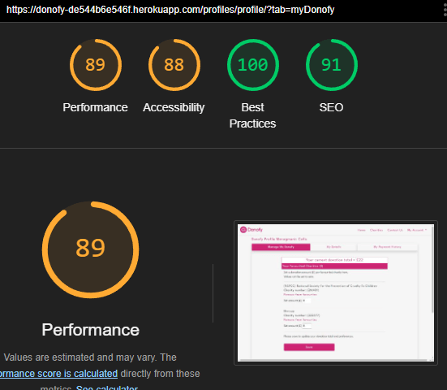

# Testing Donofy
This project was tested continuously during development. Post build, the site has been manually tested by myself and third party testers. It has also passed on html, CSS, JS, and accessibility validators. The python has pass linting checks and is compliant with PEP8 industry standards.

[return to README.md](./README.md)

**PLEASE NOTE: This documentation contains many images which can be viewed via a dropdown toggle.**
## Table of Contents
* [**During Development Testing**](#during-development-testing)
    * [*Testing*](#testing)
    * [*Bugs and Fixes*](#bugs-and-fixes)
* [**Post Development Testing**](#post-development-testing)
  * [**Manual Testing**](#manual-testing)
    * [Home Page Manual Testing](#home-page-manual-testing)
    * [Charities Page Manual Testing](#charities-page-manual-testing)
    * [Charity Detail Page Manual Testing](#charity-detail-page-manual-testing)
    * [Contact Us Page Manual Testing](#contact-us-page-manual-testing)
    * [Profile Page My Donofy Manual Testing](#profile-page-my-donofy-manual-testing)
    * [Checkout-Donate Page: Manual Testing](#checkout-donate-page-manual-testing)
    * [Checkout-Success Page: Manual Testing](#checkout-success-page-manual-testing)
  * [**User Story Testing**](#user-story-testing)
  * [**Validators**](#validators)
    * [Donofy Base App](#donofy-base-app)
    * [Index Page](#index-page)
    * [Charities Page](#charities-page)
    * [Charity Details Page](#charity-details-page)
    * [Contact Us Page](#contact-us-page)
    * [Profile Page](#profile-page)
    * [Donate Page](#donate-page)
    * [Donation Success Page](#donation-success-page)
* [**Future Bug Fixes**](#future-bug-fixes)

## **During Development Testing**
This project has been developed partially with a TTD approach. 
During the development process, I also manually tested continuously in the following ways:-

1. Manually tested each element for appearance and responsiveness via a simulated live server by running app.py in PORT 8000.

2. Checked functionality as I built. Dealing with bugs and error messages during development. (See bugs and fixes)

3. Sought feedback from my mentor and student peers at key intervals during development. 

## Testing:

### Browser Compatibility
During testing, I used three different browsers to ensure cross-compatibility. The desktop browsers used by myself were:

  1. Chrome
  2. Firefox  
  3. Edge

I have manually tested on Chrome.
Shaun Russell - Site tester - Tested on Firefox, and Edge.
Tom Harris - Site tester - Tested the project on Safari.

### Screen Sizes

The site has been tested at screen sizes 320px to 2560px in width.

INSERT IMAGE MOBILE
INSERT IMAGE DESKTOP

### Function Testing
The functions are built using a TDD approach, and also thoroughly manually tested via their output displayed in the terminal with print statements, the browser display, or both. (All print statements have been removed in the final version of the project).

[**Back to top**](#testing-donofy)
## ***Bugs and Fixes:***

Below is a list of bugs I discovered and fixed using TDD and manual testing :-

1. **Testing charities view - IntegrityError1** - 
    * ***Issue Found:*** 
        * IntegrityError thrown when testing charities.views.all_charities view
        

Integrity Error

        
        

        

Test code

        
        

    * ***Solution Used:*** 
        * Added all remaining fields that will not accept null according to the Charity Model, to the test setup.
        

Integrity Error code fix

        
        

        

Test pass

        
        

2. **Testing charities category sort**
    * ***Issue Found:***
        

Initial test failing

        
        

        

Value Error

        
        

        

Assertion Error

        
        

    * ***Solution Used:*** 
        * Value Error: required importing Charity model, and fixing some syntax.
        * Assertion Error: filters category by ID instead of name
        

Test Pass

        
        

3. **Testing charities ASC / DESC order sort**
    * ***Issue Found:***
        

Initial test failing

        
        

        

Name Error: Lower is not defined

        
        

        

Assertion Error

        
        

        

Assertion Error ASC only

        
        

    * ***Solution Used:*** 
        * Name Error: added from django.db.models.functions import Lower
        * Assertion Error: had to abandon ascend/descend feature. Category sorts will automatically sort by ascending instead.
        * Assertion Error ASC only: removed the charity with active=False as that was creating the mis-ording and causing the test to fail
        

Test Pass

        
        

4. **UserProfileAdmin errors**
    * ***Issue Found:***
        * The following errors were thrown for UserProfileAdmin during a makemigration --dry-run
        * 1 x admin.E033 error
        * 4 x admin.E108 errors
        

UserProfileAdmin Migration Errors

        
        

    * ***Solution Used:***
        * E108: changed ordering by non-existent 'date', to last_name instead
        * E108: removed the referred to fields as they will now be stored in new donations data.
        

UserProfileAdmin Migration Fixed

        
        

5. **Testing profiles**
    * ***Issue Found:***
        

First Test fail

        
        

    * ***Solution Used:***
      * Imported User from models & added a 'testuser' to provide log in details for the test.
        

First Test pass

        
        

6. **Update_subscription functionality**
    * ***Issue Found:***
        

Attribute Error on save

        
        

    * ***Solution Used:***
      * Imported the Charity model and fetched the full charity details from the list of charity IDs.
      * Changed the dict to show keys of charity_names (instead of ID ints), and int donation values. To make it easier for admin to understand the sub_breakdown by reading the dict. 
        

sub_breakdown dict saving as expected

        
        

7. **Update_subscription Invalid Literal for Int error**
    * ***Issue Found:***
        * If value for charity donation left blank on save, Value error thrown.
        

Value Error on save

        
        

    * ***Solution Used:***
      * Added a default_if_none:0 condition to the input value logic. So 0 will always be displayed instead of blank.
        

Zero default fix

        
        

[**Back to top**](#testing-donofy)  
## **Post Development Testing**

Post development, I manually tested in the following ways:-

1. Manually tested each element for appearance and responsiveness via a simulated live server.

2. The code passed through HTML, CSS, JavaScript(ES6), pep8 validators to check for errors. As well as an Accessibility evaluation.

3. Published the page via GitHub pages and shared with fellow students and friends to test and receive feedback.

## **Manual Testing**

My manual testing logs are as follows:
### Home Page Manual Testing
***
**Home Page: Main Nav bar**
* Expected:
  * All nav links to redirect to their correct page template. (Including links only present when a user/superuser is logged in).
  * All nav elements, including site logo (home link), to respond with colour change, and/or hover animation on mouse hover to indicate they are interactive.
  * Nav links turn to a burger menu on screens <768px wide.
  * Dropdown nav menus, and sub menus to stay ontop of content on all screens sizes.
  * Drop down menu toggles dropdown list of nav elements and changes dynamically based on user logged in:
    - **Guest User** = Only Register and Login present in dropdown.
    - **User logged in** = 
      - Register / Login not present.
      - My Donofy / My Details / My History / Donate / Logout, present.
    - **SuperUser logged in** = 
      - Register / Login, not present.
      - Admin / My Donofy / My Details / My History / Donate / Logout, present.
* Testing:
  * Clicked each nav link in turn to check for broken links or incorrect pages rendered.
  * Hovered my mouse over each element to check for interactive indicators.
  * Used Chrome Dev tools to check screen widths 767px and 768px wide.
  * Toggled dropdown menus on screen sizes 320px / 576px / 992px wide.
  * Inspected nav bar as a Guest User / User / Superuser
* Result:
  * All nav links routing behaved as expected.
  * All nav links changed colour and hovered on mouse hover. Donofy navbar did nothing.
  * Nav links switched to burger menu at 767px screen width.
  * Dropdowns stayed ontop of content.
  * Correct nav links show in dropdown menu according to user type.
* Action: 
  * Added custom hover class to Donofy main logo.
***
**Home Page: "How Does Donofy Work?" Nav Card Links**
* Expected:
  * The cards to respond with colour change on mouse hover, to indicate they are interactive elements.
  * The cards to go to redirect to their correct page templates, according to user:
    - Guest User:
      - **Find Your Charities** goes to Charities page.
      - **Set a Donation amount** goes to sign in page.
      - **Make an Impact** goes to sign in page.
    - Registered User:
      - **Find Your Charities** goes to Charities page.
      - **Set a Donation amount** goes to Mange My Donofy tab on profile page.
      - **Make an Impact** goes to My Payment History tab on profile page.
* Testing:
  * Hovered over each nav card
  * Clicked each card in turn to check for broken links or incorrect pages rendered.
* Result:
  * Colour changed as expected.
  * All Guest user cards redirected as expected. First two User cards behaved as expected. "Make an Impact" card incorrectly directed to Manage My Donofy tab.
* Action: 
  * Added a shadow to make it more obvious they're interactive before the user hovers over them.
  * Corrected href on "Make an Impact" card to redirect to My Payment History tab.
***
**Home Page: Footer**
* Expected:
  * All link elements Contact Us / Github / Linkedin, to indicate they are interactive.
  * Footer link elements to redirect to their correct targets
    - Contact us redirects to Contact Us page
    - Github icon opens a new tab to my Donofy repo on Github
    - Linkedin icon opens a new tab to my Linkedin page.
* Testing:
  * Hovered my mouse over each element.
  * Clicked each element.
* Result:
  * Contact Us behaved as expected. Github & Linkedin Icons did nothing.
  * All links redirected as expected. 
* Action: 
  * Corrected colour change and hover classes for Icon links
***
**Home Page: Additional Sign up buttons**
* Expected:
  * Guest users see additional Sign Up call-to-action buttons at the top and bottom of the home page.
* Testing:
  * Logged out and inspected the page.
* Result:
  * Sign up buttons appeared as expected.
* Action: 
  * Added additional sign up info the bottom sign up button so it matches the top version.
***
**Home Page: Responsiveness**
* Expected:
  * All page content to shrink, grow and rearrange according to screen width.
  * Hero text ontop of hero image to disappear on screen width <992px and reappear below instead.
  * Hero image to switch to a different version with a shorter aspect ratio. 
* Testing:
  * Used Chrome Dev Tools to inspect the home page at screen widths 320px / 576px / 768px / 992px / 1200px / 2560px.
* Result:
  * All content behaved as expected.
* Action: 
  * None
***
### Charities Page Manual Testing
***
**Charities Page: Available for all users including guests**
* Expected:
  * Charities page to be available to all users.
* Testing:
  * Navigated to Charities page as a guest / user / superuser
* Result:
  * Page behaved as expected
* Action: 
  * None
***
**Charities Page: Search Bar**
* Expected:
  * Charities to filter by keyword in the search bar.
  * Number of charities shown to indicate how many charities have been found.
* Testing:
  * Searched for "dog".
  * Searched for "donkey".
  * Searched for "child".
* Result:
  * Searches behaved as expected. Relevant charities displayed, and all others hidden. Charities found number updated correctly.
* Action: 
  * None
***
**Charities Page: Categories dropdown**
* Expected:
  * Charities to filter according to their category group.
* Testing:
  * Searched by each of the categories via the dropdown.
* Result:
  * Category filtering behaved as expected. Relevant charities displayed, and all others hidden. Charities found number updated correctly.
* Action: 
  * None
***
**Charities Page: Charity cards**
* Expected:
  * All charity cards to respond with colour change, and/or hover animation on mouse hover to indicate they are interactive.
  * Clicking the info button, or the image of the card, will direct the user to the correct charity detail page.
* Testing:
  * Hovered my mouse over each element to check for interactive indicators.
  * Clicked multiple cards in turn. Clicked multiple card Info buttons in turn.
* Result:
  * Interactive indicators present and behaving as expected.
  * Cards behaved as expected and directed to the correct charity detail page.
* Action: 
  * None
***
**Charities Page: Charity cards - Favourite Button**
* Expected:
  * Favourite button to redirect GUEST USERS to sign in page.
  * Favourite button as a LOGGED IN USER:
    - On click of Favourite, button should change to pink "Unfavourite" button.
    - On click of Favourite, message should display telling the user that charity was Successfully added to their list.
    - On click of pink Unfavourite, button should change back to white "Favourite" button.
    - On click of pint Unfavourite, message should display telling the user that charity was Successfully removed from their list.
  * Favourite's list on profiles/my Donofy should mirror the favourited charities on the charity page. 
  * Charities removed from favourites in the profiles/My Donofy, should display the correct white "Favourite" button on the charities page.
* Testing:
  * Logged out. Clicked a favourite button on a charity card.
  * Whilst logged in:
    - Clicked various favourite buttons on different charity cards.
    - Clicked various Unfavourite buttons on different charity cards.
    - Checked the My Donofy page mirrored the corrected Favourited/Unfavourited charities on the charities page.
    - Checked removing a Favourite from the user's My Donofy page, was also mirrored in the charities page.
* Result:
  * Guest User Favourite button behaved as expected and directed to the Donofy Sigin In page.
  * Logged in user: all actions behaved as expected.
* Action: 
  * Changed the message type for Unfavouriting to blue info to make it clearer to the user.
***
### Charity Detail Page Manual Testing
***
**Charity Details Page: Available for all users including guests**
* Expected:
  * Charity detail page to be available to all users.
  * Correct title / charity number / money raised figure / description / image / logo / impact statements to display for target charity.
  * Visit Website button to open the target charity's offical website in a new tab.
  * Deactivate Charity button to be present for SUPERUSERS ONLY.
* Testing:
  * Navigated to various Charity detail pages as a guest / user / superuser.
  * Navigated to various charity detail pages.
  * Clicked the Visited website button a various charity detail pages.
  * Checked for button presence as a guest / user / superuser.
* Result:
  * Page behaved as expected.
  * Pages all showed the correct information.
  * Website button behaved as expected and opened the correct site in a new tab.
  * Deactivate Button behaved as expected and only present when logged in as a superuser.
* Action: 
  * None
***
**Charity Details Page: Favourite Button**
* Expected:
  * Add to Favourite button will direct Guest User's to sign in page.
  * Users & Superusers:
    - Clicking Add to favourites button should:
      - toggle button to pink Unfavourite.
      - show success message that charity was added to favourites list. 
      - add the charity to the favourite's list on User's profile/My Donofy page.
    - Clicking the Unfavourite button should:
      - toggle the button back to white "Add to Favourites" button.
      - show an info message that charity was removed from favourites list.
      - remove the charity from the favourite's list on the User's profile/My Donofy page.
* Testing:
  * Clicked Add to Favourites button as a guest user.
  * Clicked add to favourites button on a charity detail page.
  * Clicked the Unfavourite button on a charity detail page. 
* Result:
  * Button behaved as expected and directed guest user to sign in.
  * Adding to favourites button behaved as expected.
  * Unfavourite button behaved as expected.
* Action: 
  * None
***
### Contact Us Page Manual Testing
***
**Contact Us Form Validation**
* Expected:
  * Validation checks on input fields.
* Testing:
  * Blank fields:
    * Left name field blank and tried to submit.
    * Left email field blank and tried to submit.
    * Left message field blank and tried to submit.
  * Input validation:
    * Entered numbers for name field. 
    * Entered characters with no @ symbol for email.
* Result:
  * All validation behaved as expected and error messages shown to the user. 
  * Except: Name field would accept random numbers and special characters instead of a-z.
* Action: 
  * None
  * Future validation on name field would be preferable.
***
**Contact Us Form - Sending a live message**
* Expected:
  * With valid inputs:
    - Expect contact/success template to show.
    - Expect an email to appear in donofy.uk@gmail.com inbox.
* Testing:
  * Completed the contact us form with valid inputs and clicked Send
* Result:
  * Behaved as expect. Correct template and message received in inbox.
* Action: 
  * None
***
### Profile Page: My Donofy Manual Testing
***
**Profile Page: My Donofy Tab**
* Expected:
  * Guest user's cannot access profile pages. Redirect to sign in if attempt made by forcing the url.
  * Tab navigation allows the user to flick through different sections of their profile information. Tab changes colour to indicate which section the user is viewing.
  * (Favourtes list has already been tested as part of Charities/Charity Detail Testing).
  * If no favourites. Direct user to the charites page.
  * Donation total reflects the current entries in the listed inputs.
  * "Your favourited charities" title number accurately reflects the favourited list length.
  * Inputs values will:
    - Accept integers.
    - Accept 0.
    - Accept a null (and default to 0).
    - Not accept a non-number.
    - Nor accept a float.
  * Save button accurately sums the total of the donation inputs in the in favourites list.
* Testing:
  * Logged out. Added /profiles/profile/?tab=myDonofy to the end of the site url.
  * Clicked the three different tabs in different orders.
  * (Favourites previously tested).
  * Removed all favourites from the users list.
  * Inspected the page following multiple adding/removing of charities from previous manual testing.
  * Added and removed favourites. Checking the list length each time.
  * Tested all the input variants above.
  * Entered various values. Including leaving some blank or 0.
* Result:
  * Behaved as expected and directed to the sign in page.
  * Navigation tabs worked as expected.
  * (Favourites previously tested).
  * No Favourites message appears as expected.
  * The total did not show the total reflected in the inputs, but the last total saved.
  * "Your Favourite charities" title number behaved as expected.
  * The inputs behaved as expected.
  * Save button behaved as expected. Data saved in backend. Donation total title updated in frontend. 
* Action: 
  * Add additional info for the user, above the save button on My Donofy page, and again on the Donate/checkout page. Explaining they need Save their donation preferences so their donation breakdown and total is what they expect.  
***
**Profile Page: My Details Tab**
* Expected:
  * Generic placeholders show if no user data saved.
  * Data entered into the form to update the user data on save.
  * Saved data prepopulates the form instead of generic placeholders.
  * Form validation on phone number field. 
* Testing:
  * Removed all previously saved info, saved.
  * Entered a full form, saved, and inspected the data in the admin.
  * Inspected the form from previous save. Refreshed the page, navigated to home and returned.
  * Attempted to save letters and special characters in phone number input. 
* Result:
  * Form behaved as expected. Except for Country. On save, a validation message does not allow country to be blank.
  * Save behaved as expected. Except for email. Email will not change from the email the user registered with.
  * Form behaved as expected with prepopulated saved data.
  * Phone input behaved as expected. Showed and error and gave formet instructions to the user when they try to save an invalid phone number.
* Action: 
  * Edited UserProfile model to accept blank=True.
  * Removed the email input in the form. Plus added a message under the form header, to inform the user that username and email cannot be changed. Prompts them to Contact Us with a helpful anchor. 
***
**Profile Page: My Payment History Tab**
* Expected:
  * If no payment history exists, display a helpful message.
  * User's payment history listed with relevent info, and in descending date order (most recent at the top).
* Testing:
  * Logged in as admin user with no donations. Inspected the page.
  * Logged on as a user with donation history. Inspected the page.
* Result:
  * Behaved as expected, but the message just a basic paragraph that said "No donations found".
  * Listed donation history behaved as expected.
* Action: 
  * Added a friendlier message with site styling, and a helpful anchor directing them to their My Donofy section.
***
### Checkout-Donate Page: Manual Testing
***
**Donation form**
* Expected:
  * If donation total = 0, give user an error message and send back to index page.
  * Donate page shows current SAVED donation preferences with correct info.
  * If no user personal details saved, donation form will show generic placeholders in all fields.
  * If user personal details save, donation form will prepopulate form with their data.
  * Form fields left blank. Expect donation attempt to halt and error message display to the user.
  * Form validation on email, phone number, and card payments.
* Testing:
  * Set and saved a zero subscription in My Donofy, navigated to Donate page.
  * Set and saved some different values, for varying number of charities. Navigated to the Donate page.
  * Cleared all personal data from user, inspected Donate page.
  * Saved full profile info in My Details for the current user. Inspected the Donate page.
  * Tried a blank entry for each field in turn and tried to submit the form.
  * Entered invalid data for each field in turn. Tried to submit the form.
* Result:
  * Site behaved as expected, error message and redirect to index page.
  * Donate page behaved as expected and showed the correct data.
  * Placeholders displaying as expected.
  * Donation form prepopulated as expected. Except for email since this was removed as part of profile manual testing.
  * All strictly required fields behaved as expected. Form submitted with option data blank.
  * Invalid email, phone and card payments halted the donation as expected. Error message appeared.
* Action: 
  * None. Email autofill included in Future Bug Fixes list.
***
### Checkout-Success Page: Manual Testing
***
**Donation/Checkout Success**
* Expected:
  * On valid form submission, direct to checkout/billing_success page.
  * Donation Successful page gives a breakdown of all the correct data.
  * Live email thank you a breakdown of donation made sent to the user.
* Testing:
  * Made a test payment.
* Result:
  * Site behaved as expected and correct success template rendered.
  * Site behaved as expected and Donation Successful template displayed all the correct information.
  * Site behaved as expected and confirmation email, with all the correct data, received.
* Action: 
  * None
***

[**Back to top**](#testing-donofy)

### User Stories Testing

[**Back to top**](#testing-donofy)
## **Validators**

I've thoroughly validated Donofy with the following validators:
  - **HTML** https://validator.w3.org/
  - **CSS** https://jigsaw.w3.org/css-validator/
  - **JS** https://jshint.com/
  - **CI Python Linter** https://pep8ci.herokuapp.com/
  - **Accessibility** https://wave.webaim.org/

Here are my reports on validation tests by page.

### Donofy Base App

View current donofy app PEP8 Linter results here:

PEP8 linter for settings.py

PEP8 linter for donofy/urls.py

 

### Index Page

View Current Home Page validator results here:

- [HTML results](https://validator.w3.org/nu/?doc=https%3A%2F%2Fdonofy-de544b6e546f.herokuapp.com%2F)
- [CSS results](https://jigsaw.w3.org/css-validator/validator?uri=https%3A%2F%2Fdonofy-de544b6e546f.herokuapp.com%2F&profile=css3svg&usermedium=all&warning=1&vextwarning=&lang=en)
- 

Current JS results

  
  
 
- 

PEP8 linter for home/views.py

  
  
 
- 

PEP8 linter for home/urls.py

  
  
 
- [ACCESSIBILITY results](https://wave.webaim.org/report#/https://donofy-de544b6e546f.herokuapp.com/)
- 

Lighthouse Scores Desktop

  
  
 
- 

Lighthouse Scores Mobile

  
  

### Index HTML Validator

HTML validator inital results

* ***Errors Found:***
    * 6 Attribute Errors.
    * 2 Type Attribute Warnings.
* ***Action Taken:***
    * Removed unecessary attributes.
    * Gave the hero images blank alt tags, as they're decorative and offer no additional info to the user.

### Index CSS Validator

CSS validator inital results

* ***Errors Found:***
    * Value Error on .footer-box
* ***Action Taken:***
    * Removed display: absolute;

### Index JavaScript Validator

Initial JS results for Home

 

JSHint validator was configured to recognise New JavaScript Features (ES6), and jQuery.
* ***Errors Found:***
    * Trailing comma
* ***Action Taken:***
    * Removed comma

### Index Python CI Linter (PEP8 check)

* ***Errors Found:***
    * None.
* ***Action Taken:***
    * None.

### Index Accessibility Evaluation

Wave inital results

* ***Errors Found:***
    * Missing alt tags
    * 3x contrast errors on hero text
* ***Action Taken:***
    * Add alt tags to hero images
    * Darkened background on all hero text to increase contrast.

### Index Lighthouse Scores
### Test conditions
* All lighthouse tests were run from heroku and in incognito mode to avoid interference. 
* Both mobile and desktop performance are tested.
* The drop in performance is mainly due to Heroku, Stripe, and a large amount of layout behaviours to keep my site responsive. 
* All testers reported good load and response times on both desktop and mobile devices, so no adjustments will be made at this time. 

- Actions taken:
    - Hero images PNGs were replaced with webp files to try to increase performance. Small improvement recorded.

Desktop Results Inital

Lighthouse Scores Desktop

 

Lighthouse Scores Mobile

 
 

### Charities Page

View Current Charities Page validator results here:

- [HTML results](https://validator.w3.org/nu/?doc=https%3A%2F%2Fdonofy-de544b6e546f.herokuapp.com%2Fcharities%2Fcharities%2F)
- [CSS results](https://jigsaw.w3.org/css-validator/validator?uri=https%3A%2F%2Fdonofy-de544b6e546f.herokuapp.com%2Fcharities%2Fcharities%2F&profile=css3svg&usermedium=all&warning=1&vextwarning=&lang=en)
- No JS for charities page
- 

PEP8 linter for charities/views.py

  
  
 
- 

PEP8 linter for charities/urls.py

  
  
 
- [ACCESSIBILITY results](https://wave.webaim.org/report#/https://donofy-de544b6e546f.herokuapp.com/charities/charities/)

### Charities HTML Validator

HTML validator inital results

* ***Errors Found:***
    * Nested anchor errors for each charity card looped through. 
* ***Action Taken:***
    * Removed the anchor surrounding the whole card body.
    * Put an anchor around the card image instead.

### Charities CSS Validator

CSS validator inital results

* ***Errors Found:***
    * Line spacing issue on redundant css custom class .unfavourite.
* ***Action Taken:***
    * Removed class .unfavourite.
    * Adjusted the current css class that controls the pink unfavourite button styles. 

### Charities JavaScript Validator

No Javascript used for Charities page

### Charities Python CI Linter (PEP8 check)

Passed first time. See current results above.

### Charities Accessibility Evaluation

Passed first time. See current results above.

### Charities Lighthouse Scores
### Test conditions
* All lighthouse tests were run from heroku and in incognito mode to avoid interference. 
* Both mobile and desktop performance are tested.
* The drop in performance is mainly due to Heroku, Stripe, and a large amount of layout behaviours to keep my site responsive. 
* All testers reported good load and response times on both desktop and mobile devices, so no adjustments will be made at this time. 

Desktop Results Current

 

Mobile Results Current

 
 

### Charity Details Page

View Current Charity Details Page validator results here:

- [HTML results](https://validator.w3.org/nu/?doc=https%3A%2F%2Fdonofy-de544b6e546f.herokuapp.com%2Fcharities%2Fcharity_detail%2F4%2F)
- [CSS results](https://jigsaw.w3.org/css-validator/validator?uri=https%3A%2F%2Fdonofy-de544b6e546f.herokuapp.com%2Fcharities%2Fcharity_detail%2F4%2F&profile=css3svg&usermedium=all&warning=1&vextwarning=&lang=en)
- No JS for charities page
- 

PEP8 linter for charities/views.py

  
  
 
- 

PEP8 linter for charities/urls.py

  
  
 
- [ACCESSIBILITY results](https://wave.webaim.org/report#/https://donofy-de544b6e546f.herokuapp.com/charities/charity_detail/4/)

### Charity Details HTML Validator

Passed first time. See current results above.

### Charity Details CSS Validator

Passed first time. See current results above.

### Charity Details JavaScript Validator

No Javascript used for Charities page

### Charity Details Python CI Linter (PEP8 check)

Passed first time. See current results above.

### Charity Details Accessibility Evaluation

Passed first time. See current results above.

### Contact Us Page

View Current Contact Us Page validator results here:

- [HTML results](https://validator.w3.org/nu/?doc=https%3A%2F%2Fdonofy-de544b6e546f.herokuapp.com%2Fcontact%2F)
- [CSS results](https://jigsaw.w3.org/css-validator/validator?uri=https%3A%2F%2Fdonofy-de544b6e546f.herokuapp.com%2Fcontact%2F&profile=css3svg&usermedium=all&warning=1&vextwarning=&lang=en)
- No JS for charities page
- 

PEP8 linter for home/views.py

  
  
 
- 

PEP8 linter for home/urls.py

  
  
 
- [ACCESSIBILITY results](https://wave.webaim.org/report#/https://donofy-de544b6e546f.herokuapp.com/contact/)

### Contact Us HTML Validator

HTML validator inital results

* ***Errors Found:***
    * 2x Trailing slash errors.
* ***Action Taken:***
    * Removed the trailing slashes.

### Contact Us CSS Validator

Passed first time. See current results above.

### Contact Us JavaScript Validator

No Javascript used for Charities page

### Contact Us Python CI Linter (PEP8 check)

Passed first time. See current results above.

### Contact Us Accessibility Evaluation

Contact Us inital results
 

* ***Errors Found:***
    * Contrast Error on "All form fields above are required" message above Send button.
* ***Action Taken:***
    * Removed text-muted class.

### Profile Page

View Current Profile Page validator results here:

- [HTML results: My Donofy tab](https://validator.w3.org/nu/?doc=https%3A%2F%2Fdonofy-de544b6e546f.herokuapp.com%2Fprofiles%2Fprofile%2F%3Ftab%3DmyDonofy)
- [HTML results: My Details tab](https://validator.w3.org/nu/?doc=https%3A%2F%2Fdonofy-de544b6e546f.herokuapp.com%2Fprofiles%2Fprofile%2F%3Ftab%3DmyDetails)
- [HTML results: My History tab](https://validator.w3.org/nu/?doc=https%3A%2F%2Fdonofy-de544b6e546f.herokuapp.com%2Fprofiles%2Fprofile%2F%3Ftab%3DmyHistory)
- [CSS results: My Donofy tab](https://jigsaw.w3.org/css-validator/validator?uri=https%3A%2F%2Fdonofy-de544b6e546f.herokuapp.com%2Fprofiles%2Fprofile%2F%3Ftab%3DmyDonofy&profile=css3svg&usermedium=all&warning=1&vextwarning=&lang=en)
- [CSS results: My Details tab](https://jigsaw.w3.org/css-validator/validator?uri=https%3A%2F%2Fdonofy-de544b6e546f.herokuapp.com%2Fprofiles%2Fprofile%2F%3Ftab%3DmyDetails&profile=css3svg&usermedium=all&warning=1&vextwarning=&lang=en)
- [CSS results: My History tab](https://jigsaw.w3.org/css-validator/validator?uri=https%3A%2F%2Fdonofy-de544b6e546f.herokuapp.com%2Fprofiles%2Fprofile%2F%3Ftab%3DmyHistory&profile=css3svg&usermedium=all&warning=1&vextwarning=&lang=en)
- 

JS current results

  
  
 
- 

PEP8 linter for profiles/views.py

  
  
 
- 

PEP8 linter for profiles/urls.py

  
- 

PEP8 linter for profiles/admin.py

  
- 

PEP8 linter for profiles/forms.py

  
- 

PEP8 linter for profiles/models.py

  
- [ACCESSIBILITY results: My Donofy tab](https://wave.webaim.org/report#/https://donofy-de544b6e546f.herokuapp.com/profiles/profile/?tab=myDonofy)
- [ACCESSIBILITY results: My Details tab](https://wave.webaim.org/report#/https://donofy-de544b6e546f.herokuapp.com/profiles/profile/?tab=myDetails)
- [ACCESSIBILITY results: My History tab](https://wave.webaim.org/report#/https://donofy-de544b6e546f.herokuapp.com/profiles/profile/?tab=myHistory)
- 

Lighthouse Scores MY DONOFY Desktop

  
  
 
- 

Lighthouse Scores MY DONOFY Mobile

  
  

- 

Lighthouse Scores MY DETAILS Desktop

  
  
 
- 

Lighthouse Scores MY DETAILS Mobile

  
  

- 

Lighthouse Scores MY HISTORY Desktop

  
  
 
- 

Lighthouse Scores MY HISTORY Mobile

  
  

### Profile HTML Validator

All 3 tabs passed first time. See current results above.

 ### Profile CSS Validator

All 3 tabs passed first time. See current results above.

### Profile JavaScript Validator

Passed first time. See current results above.

### Profile Python CI Linter (PEP8 check)

Passed first time. See current results above.

### Profile Accessibility Evaluation

Attempts were made to check each page, but on closer inspection it looks like it defaulted to checking the sign in page. Donofy security working as intended to prevent unauthorised users from accessing user pages with sensitive data.

### Donate Page

View Current Donate Page validator results here:

- [HTML results](https://validator.w3.org/nu/?doc=https%3A%2F%2Fdonofy-de544b6e546f.herokuapp.com%2Faccounts%2Flogin%2F%3Fnext%3D%2Fcheckout%2Fcheckout%2F)
- [CSS results](https://jigsaw.w3.org/css-validator/validator?uri=https%3A%2F%2Fdonofy-de544b6e546f.herokuapp.com%2Fcheckout%2Fcheckout%2F&profile=css3svg&usermedium=all&warning=1&vextwarning=&lang=en)
- 

Current JS results

  
  
 
- 

PEP8 linter for checkout/views.py

  
  
 
- 

PEP8 linter for checkout/urls.py

  
  

- 

PEP8 linter for checkout/admin.py

  
  

- 

PEP8 linter for checkout/forms.py

  
  

- 

PEP8 linter for checkout/models.py

  
  

- 

PEP8 linter for checkout/webhook.py

  
  

- 

PEP8 linter for checkout/webhook_handler.py

  
  
 
- No ACCESSIBILITY results
- 

Lighthouse Scores Desktop

  
  
 
- 

Lighthouse Scores Mobile

  
  

### Donate HTML Validator

Passed first time. See current results above.

 ### Donate CSS Validator

Passed first time. See current results above.

### Donate JavaScript Validator

* ***Errors Found:***
    * One undefined Variable: Stripe. 
* ***Action Taken:***
    * Attempts to correct this cause my stripe card input to display badly, and become unusable. Error left in the my code. Maybe a future fix.

### Donate Python CI Linter (PEP8 check)

Passed first time. See current results above.

### Donate Accessibility Evaluation

Attempts were made to check the donate page, but on closer inspection it looks like it defaulted to checking the sign in page. Donofy security working as intended to prevent unauthorised users from accessing user pages with sensitive data.

### Donation Success Page

View Current Donate Page validator results here:

- [HTML results](https://validator.w3.org/nu/?doc=https%3A%2F%2Fdonofy-de544b6e546f.herokuapp.com%2Fcheckout%2Fbilling_success%2F4AFBF03E63A440028672F0396D777EBE)
- [CSS results](https://jigsaw.w3.org/css-validator/validator?uri=https%3A%2F%2Fdonofy-de544b6e546f.herokuapp.com%2Fcheckout%2Fbilling_success%2F4AFBF03E63A440028672F0396D777EBE&profile=css3svg&usermedium=all&warning=1&vextwarning=&lang=en)
- No JS for Donation Success page
- Python Linter checked as part of Donate page (see above)
- No ACCESSIBILITY results
- 

Lighthouse Scores Desktop

  
  
 
- 

Lighthouse Scores Mobile

  
  

### Donation Success HTML Validator

Passed first time. See current results above.

 ### Donation Success CSS Validator

Passed first time. See current results above.

### Donation Success JavaScript Validator

No JS for Donation Success page.

### Donation Success Python CI Linter (PEP8 check)

Python Linter checked as part of Donate page (see above)

### Donation Success Accessibility Evaluation

Attempts were made to check the Donation Success page, but on closer inspection it looks like it defaulted to checking the sign in page. Donofy security working as intended to prevent unauthorised users from accessing user pages with sensitive data.

## **Future Bug Fixes** 
Due to deadline constraints, some bugs remain in this version of Donofy. Whilst they are not project breaking, these are some bugs I'm aware are left unsolved. I would address these going forward before expanding to additional future features.

**Most site images nested inside the project Static folder**
  - During development MEDIA links to images inside the correct root Media folder would not display. To get around this I relocated them to static instead so the site displays as intended.

**Donation form doesn't prepopulate with user's email**. Discovered during manual testing, following the removal of the email field in the My Details form. This would be future bug fix. 

**USA Stripe Element**
 - The current stripe element input for card payments asks for a zipcode. Zip codes are not applicable for UK users. I would change the Stripe element to it's UK version. Better still, I would have it change dynamically based on a user's input in the Country field (if the site were to go global).

## Thank you to my product testers
- Richard Wells
- Shaun Russell
- Tom Harris

[**Back to top**](#testing-donofy)

[return to README.md](./README.md)