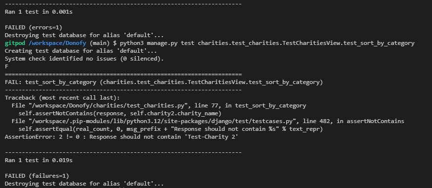
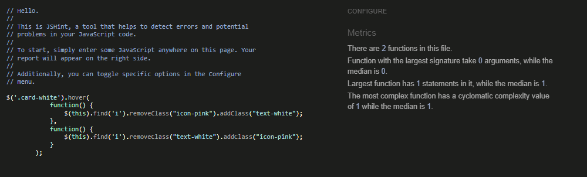
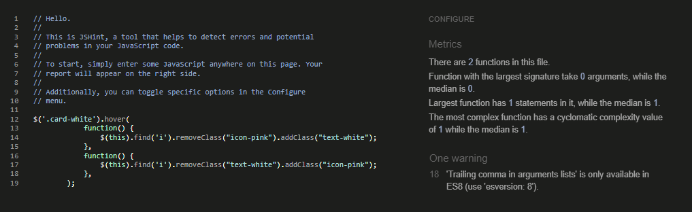

# Testing Donofy
This project was tested continuously during development. Post build, the site has been manually tested by myself and third party testers. It has also passed on html, CSS, JS, and accessibility validators. The python has pass linting checks and is compliant with PEP8 industry standards.

[return to README.md](./README.md)

**PLEASE NOTE: This documentation contains many images which can be viewed via a dropdown toggle.**
## Table of Contents
* [**During Development Testing**](#during-development-testing)
    * [*Testing*](#testing)
    * [*Bugs and Fixes*](#bugs-and-fixes)
* [**Post Development Testing**](#post-development-testing)
  * [**Manual Testing**](#manual-testing)
    * [Home Page Manual Testing](#home-page-manual-testing)
  * [**User Story Testing**](#user-story-testing)
  * [**Validators**](#validators)
    *
  * [**Lighthouse Scores**](#lighthouse-scores)
  * [**Accessibility**](#accessibility)
* [**Future Bug Fixes**](#future-bug-fixes)

## **During Development Testing**
This project has been developed partially with a TTD approach. 
During the development process, I also manually tested continuously in the following ways:-

1. Manually tested each element for appearance and responsiveness via a simulated live server by running app.py in PORT 8000.

2. Checked functionality as I built. Dealing with bugs and error messages during development. (See bugs and fixes)

3. Sought feedback from my mentor and student peers at key intervals during development. 

## Testing:

### Browser Compatibility
During testing, I used three different browsers to ensure cross-compatibility. The desktop browsers used by myself were:

  1. Chrome
  2. Firefox  
  3. Edge

I have manually tested on Chrome.
Shaun Russell - Site tester - Tested on Firefox, and Edge.
Tom Harris - Site tester - Tested the project on Safari.

### Screen Sizes

The site has been tested at screen sizes 320px to 2560px in width.

INSERT IMAGE MOBILE
INSERT IMAGE DESKTOP

### Function Testing
The functions are built using a TDD approach, and also thoroughly manually tested via their output displayed in the terminal with print statements, the browser display, or both. (All print statements have been removed in the final version of the project).

[**Back to top**](#testing-donofy)
## ***Bugs and Fixes:***

Below is a list of bugs I discovered and fixed using TDD and manual testing :-

1. **Testing charities view - IntegrityError1** - 
    * ***Issue Found:*** 
        * IntegrityError thrown when testing charities.views.all_charities view
        

Integrity Error

        
        

        

Test code

        
        

    * ***Solution Used:*** 
        * Added all remaining fields that will not accept null according to the Charity Model, to the test setup.
        

Integrity Error code fix

        
        

        

Test pass

        
        

2. **Testing charities category sort**
    * ***Issue Found:***
        

Initial test failing

        
        

        

Value Error

        
        

        

Assertion Error

        
        

    * ***Solution Used:*** 
        * Value Error: required importing Charity model, and fixing some syntax.
        * Assertion Error: filters category by ID instead of name
        

Test Pass

        
        

3. **Testing charities ASC / DESC order sort**
    * ***Issue Found:***
        

Initial test failing

        
        

        

Name Error: Lower is not defined

        
        

        

Assertion Error

        
        

        

Assertion Error ASC only

        
        

    * ***Solution Used:*** 
        * Name Error: added from django.db.models.functions import Lower
        * Assertion Error: had to abandon ascend/descend feature. Category sorts will automatically sort by ascending instead.
        * Assertion Error ASC only: removed the charity with active=False as that was creating the mis-ording and causing the test to fail
        

Test Pass

        
        

4. **UserProfileAdmin errors**
    * ***Issue Found:***
        * The following errors were thrown for UserProfileAdmin during a makemigration --dry-run
        * 1 x admin.E033 error
        * 4 x admin.E108 errors
        

UserProfileAdmin Migration Errors

        
        

    * ***Solution Used:***
        * E108: changed ordering by non-existent 'date', to last_name instead
        * E108: removed the referred to fields as they will now be stored in new donations data.
        

UserProfileAdmin Migration Fixed

        
        

5. **Testing profiles**
    * ***Issue Found:***
        

First Test fail

        
        

    * ***Solution Used:***
      * Imported User from models & added a 'testuser' to provide log in details for the test.
        

First Test pass

        
        

6. **Update_subscription functionality**
    * ***Issue Found:***
        

Attribute Error on save

        
        

    * ***Solution Used:***
      * Imported the Charity model and fetched the full charity details from the list of charity IDs.
      * Changed the dict to show keys of charity_names (instead of ID ints), and int donation values. To make it easier for admin to understand the sub_breakdown by reading the dict. 
        

sub_breakdown dict saving as expected

        
        

7. **Update_subscription Invalid Literal for Int error**
    * ***Issue Found:***
        * If value for charity donation left blank on save, Value error thrown.
        

Value Error on save

        
        

    * ***Solution Used:***
      * Added a default_if_none:0 condition to the input value logic. So 0 will always be displayed instead of blank.
        

Zero default fix

        
        

[**Back to top**](#testing-donofy)  
## **Post Development Testing**

Post development, I manually tested in the following ways:-

1. Manually tested each element for appearance and responsiveness via a simulated live server.

2. The code passed through HTML, CSS, JavaScript(ES6), pep8 validators to check for errors. As well as an Accessibility evaluation.

3. Published the page via GitHub pages and shared with fellow students and friends to test and receive feedback.

## **Manual Testing**

My manual testing logs are as follows:
### Home Page Manual Testing
***
**Home Page: Main Nav bar**
* Expected:
  * All nav links to redirect to their correct page template. (Including links only present when a user/superuser is logged in).
  * All nav elements, including site logo (home link), to respond with colour change, and/or hover animation on mouse hover to indicate they are interactive.
  * Nav links turn to a burger menu on screens <768px wide.
  * Dropdown nav menus, and sub menus to stay ontop of content on all screens sizes.
  * Drop down menu toggles dropdown list of nav elements and changes dynamically based on user logged in:
    - **Guest User** = Only Register and Login present in dropdown.
    - **User logged in** = 
      - Register / Login not present.
      - My Donofy / My Details / My History / Donate / Logout, present.
    - **SuperUser logged in** = 
      - Register / Login, not present.
      - Admin / My Donofy / My Details / My History / Donate / Logout, present.
* Testing:
  * Clicked each nav link in turn to check for broken links or incorrect pages rendered.
  * Hovered my mouse over each element to check for interactive indicators.
  * Used Chrome Dev tools to check screen widths 767px and 768px wide.
  * Toggled dropdown menus on screen sizes 320px / 576px / 992px wide.
  * Inspected nav bar as a Guest User / User / Superuser
* Result:
  * All nav links routing behaved as expected.
  * All nav links changed colour and hovered on mouse hover. Donofy navbar did nothing.
  * Nav links switched to burger menu at 767px screen width.
  * Dropdowns stayed ontop of content.
  * Correct nav links show in dropdown menu according to user type.
* Action: 
  * Added custom hover class to Donofy main logo.
***
**Home Page: "How Does Donofy Work?" Nav Card Links**
* Expected:
  * The cards to respond with colour change on mouse hover, to indicate they are interactive elements.
  * The cards to go to redirect to their correct page templates, according to user:
    - Guest User:
      - **Find Your Charities** goes to Charities page.
      - **Set a Donation amount** goes to sign in page.
      - **Make an Impact** goes to sign in page.
    - Registered User:
      - **Find Your Charities** goes to Charities page.
      - **Set a Donation amount** goes to Mange My Donofy tab on profile page.
      - **Make an Impact** goes to My Payment History tab on profile page.
* Testing:
  * Hovered over each nav card
  * Clicked each card in turn to check for broken links or incorrect pages rendered.
* Result:
  * Colour changed as expected.
  * All Guest user cards redirected as expected. First two User cards behaved as expected. "Make an Impact" card incorrectly directed to Manage My Donofy tab.
* Action: 
  * Added a shadow to make it more obvious they're interactive before the user hovers over them.
  * Corrected href on "Make an Impact" card to redirect to My Payment History tab.
***
**Home Page: Footer**
* Expected:
  * All link elements Contact Us / Github / Linkedin, to indicate they are interactive.
  * Footer link elements to redirect to their correct targets
    - Contact us redirects to Contact Us page
    - Github icon opens a new tab to my Donofy repo on Github
    - Linkedin icon opens a new tab to my Linkedin page.
* Testing:
  * Hovered my mouse over each element.
  * Clicked each element.
* Result:
  * Contact Us behaved as expected. Github & Linkedin Icons did nothing.
  * All links redirected as expected. 
* Action: 
  * Corrected colour change and hover classes for Icon links
***
**Home Page: Additional Sign up buttons**
* Expected:
  * Guest users see additional Sign Up call-to-action buttons at the top and bottom of the home page.
* Testing:
  * Logged out and inspected the page.
* Result:
  * Sign up buttons appeared as expected.
* Action: 
  * Added additional sign up info the bottom sign up button so it matches the top version.
***
**Home Page: Responsiveness**
* Expected:
  * All page content to shrink, grow and rearrange according to screen width.
  * Hero text ontop of hero image to disappear on screen width <992px and reappear below instead.
  * Hero image to switch to a different version with a shorter aspect ratio. 
* Testing:
  * Used Chrome Dev Tools to inspect the home page at screen widths 320px / 576px / 768px / 992px / 1200px / 2560px.
* Result:
  * All content behaved as expected.
* Action: 
  * None
***
**TEST NAME**
* Expected:
  * 
* Testing:
  * 
* Result:
  * 
* Action: 
  * 
***

[**Back to top**](#testing-donofy)

### User Stories Testing

[**Back to top**](#testing-donofy)
## **Validators**

I've thoroughly validated Donofy with the following validators:
  - **HTML** https://validator.w3.org/
  - **CSS** https://jigsaw.w3.org/css-validator/
  - **JS** https://jshint.com/
  - **CI Python Linter** https://pep8ci.herokuapp.com/
  - **Accessibility** https://wave.webaim.org/

Here are my reports on validation tests by page.

### Donofy Base App

View current donofy app PEP8 Linter results here:

PEP8 linter for settings.py

PEP8 linter for donofy/urls.py

 

### Index Page

View Current Home Page validator results here:
- [HTML results]()
- [CSS results]()
- 

Current JS results

  
  
 
- 

PEP8 linter for home/views.py

  
  
 
- 

PEP8 linter for home/urls.py

  
  
 
- [ACCESSIBILITY results]()

### Index HTML

HTML validator inital results

* ***Errors Found:***
    * 6 Attribute Errors.
    * 2 Type Attribute Warnings.
* ***Action Taken:***
    * Removed unecessary attributes.
    * Gave the hero images blank alt tags, as they're decorative and offer no additional info to the user.

### Index CSS

CSS validator inital results

* ***Errors Found:***
    * Value Error on .footer-box
* ***Action Taken:***
    * Removed display: absolute;

### Index JavaScript Validator - [View initial results here]()

Initial JS results for Home

 

JSHint validator was configured to recognise New JavaScript Features (ES6), and jQuery.
* ***Errors Found:***
    * Trailing comma
* ***Action Taken:***
    * Removed comma

### Index Python CI Linter (PEP8 check)

* ***Errors Found:***
    * None.
* ***Action Taken:***
    * None.

## Lighthouse Scores
### Test conditions
* All lighthouse tests were run from heroku and in incognito mode to avoid interference. 
* Both mobile and desktop performance are tested.
* The drop in performance on mobile is likely due to Heroku. 
* All testers reported good load and response times on both desktop and mobile devices, so no adjustments will be made at this time. 

Desktop Results

 

Mobile Results

 
 

## **Accessibility** 
In addition to the accessibility score on lighthouse, WAVE - Web accessibility evaluation tool has been used to check the site for accessibility issues.. 
[View my results here]()  

Wave Accessibility Evaluation Results Image

 

Wave Alerts Image

 

* ***Errors Found:***
    * 
* ***Alerts Found:***
    * 
* ***Action Taken:***
    * 

## **Future Bug Fixes** 
Due to deadline constraints, some bugs remain in this version of Donofy. Whilst they are not project breaking, these are some bugs I'm aware are left unsolved. I would address these going forward before expanding to additional future features.

**Most site images nested inside the project Static folder**
  - During development MEDIA links to images inside the correct root Media folder would not display. To get around this I relocated them to static instead so the site displays as intended.

**USA Stripe Element**
 - The current stripe element input for card payments asks for a zipcode. Zip codes are not applicable for UK users. I would change the Stripe element to it's UK version. Better still, I would have it change dynamically based on a user's input in the Country field (if the site were to go global).

## Thank you to my product testers
- Richard Wells
- Shaun Russell
- Tom Harris

[**Back to top**](#testing-donofy)

[return to README.md](./README.md)